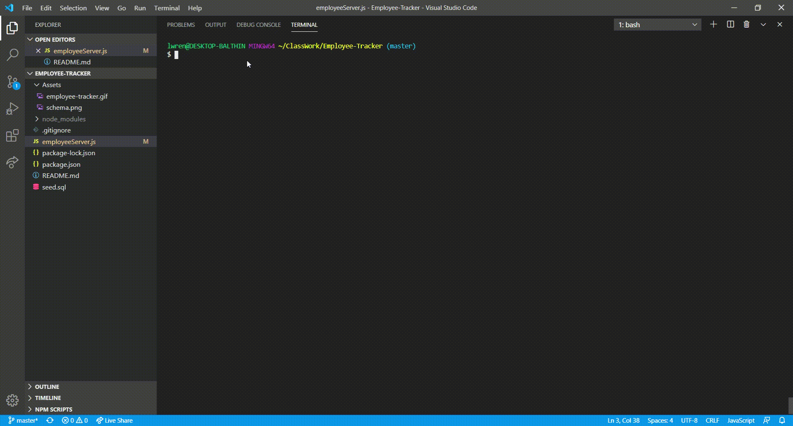

# Employee Tracker

## Project Description  
The Employee Tracker application's purpose is to organize and modify a company's employee data. Roles, departments, salaries, employees, and managers can all be tracked with the application. This keeps the company's data clear and organized for future reviewing, adding and updating.

## Instructions for use
A demo of the application in use can be seen here:

The application offers a menu of actions to perform on the employee database. This includes viewing, updating, adding and deleting. Follow the prompts for each action.

- - -
© 2020 Laynah Varnum
